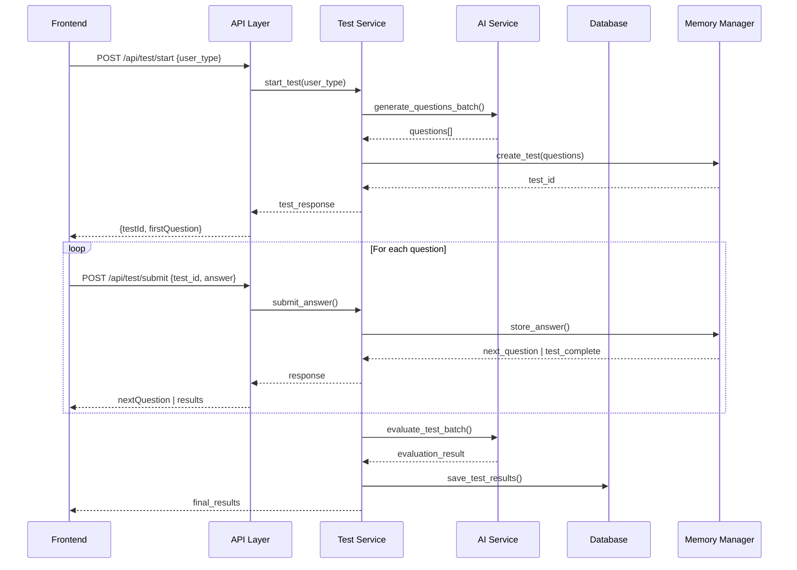

# TMPS Development Guide - System Architecture & Design Decisions

## ?? System Understanding for Future Development

This document explains the **WHY** behind every architectural decision, design pattern, and implementation choice in the TMPS (Test Management and Practice System). Use this as context for future development and maintenance.

---

## ?? Project Genesis & Core Requirements

### **Original Problem Statement**
- Build a **scalable mock testing system** supporting both technical (developer) and non-technical assessments
- Handle **server unavailability** gracefully with offline functionality
- Support **AI-powered question generation** with fallback mechanisms
- Provide **real-time testing experience** with timers and progress tracking
- Generate **comprehensive results** with analytics and PDF reports

### **Critical Business Requirements**
1. **Dual User Types**: Developers need coding challenges, Non-developers need multiple choice
2. **Offline Capability**: System must work when external services (DB/AI) are down
3. **Performance**: Handle multiple concurrent users without degradation
4. **Scalability**: Modular architecture for easy feature additions
5. **Reliability**: Graceful error handling and automatic fallbacks

---

## ?? Architecture Philosophy & Design Decisions

### **Why Modular Architecture?**

```
Frontend (React) ?? API Gateway ?? Business Logic ?? External Services
     ?                   ?              ?              ?
- Components        - Routes      - Services     - Database
- Services          - Validation  - Core Logic   - AI APIs
- State Mgmt        - Transform   - Utils        - File System
```

**Decision Rationale:**
- **Separation of Concerns**: Each layer has a single responsibility
- **Testability**: Individual components can be tested in isolation
- **Maintainability**: Changes in one layer don't affect others
- **Scalability**: Can scale individual components independently

### **Why Dummy Data Pattern?**

**The Problem**: Company servers frequently go down, blocking development/testing.

**The Solution**: Dual-mode operation with automatic fallback.

```python
# Core pattern used throughout
if config.USE_DUMMY_DATA:
    return self._generate_dummy_questions(user_type, question_count)
else:
    # Real AI/Database operations
    return self._call_real_services()
```

**Why This Pattern:**
- **Development Continuity**: Never blocked by external service outages
- **Testing Reliability**: Consistent, predictable data for testing
- **Demo Capability**: Can demo system anywhere without dependencies
- **Debugging**: Easier to debug with known data sets

---

## ?? Data Flow Architecture & Why It Works

### **Test Lifecycle Flow**



### **Why This Flow:**
1. **Memory-First**: Active tests stored in memory for speed
2. **Batch Processing**: Generate all questions at once, evaluate in batch
3. **Stateful Management**: Server maintains test state, not client
4. **Atomic Operations**: Each answer submission is atomic

---

## ?? Component Design Patterns & Rationale

### **Frontend Component Architecture**

```
MockTestStart.jsx          ? User type selection & test initialization
     ?
DeveloperTest.jsx         ? Coding questions with text input
NonDeveloperTest.jsx      ? Multiple choice questions
     ?
MockTestResults.jsx       ? Results display with analytics
```

**Why Separate Components:**
- **User Experience**: Different UX patterns for different user types
- **Maintainability**: Changes to developer tests don't affect non-developer tests
- **Performance**: Code splitting - only load relevant components
- **Testing**: Can test each user journey independently

### **State Management Pattern**

```javascript
// Why we use React useState + navigation state instead of Redux:

// In MockTestStart.jsx
const navigationState = {
  testData: {
    testId, sessionId, userType, totalQuestions,
    raw: apiResponse  // Keep original for debugging
  }
};
navigate('/test', { state: navigationState });

// In test components
const testData = location.state?.testData;
const testId = testData?.testId || testData?.raw?.test_id; // Multiple fallbacks
```

**Rationale:**
- **Simplicity**: No global state management overhead for simple flow
- **Browser Support**: Works with browser back/forward buttons
- **Debugging**: Complete state visible in navigation
- **Fallback Safety**: Multiple ways to extract same data

---

## ?? Backend Service Architecture & Why

### **Service Layer Pattern**

```python
# Why we separate concerns this way:

test_service.py       ? Business logic, orchestration
ai_services.py        ? AI operations, question generation/evaluation  
database.py           ? Data persistence, connection management
content_service.py    ? Content processing, context generation
utils.py              ? Memory management, caching, validation
```

**Design Principles:**
1. **Single Responsibility**: Each service has one clear purpose
2. **Dependency Injection**: Services inject dependencies, not create them
3. **Interface Consistency**: All services follow same patterns
4. **Error Isolation**: Failures in one service don't cascade

### **Memory Management Strategy**

```python
# Why in-memory storage for active tests:

class MemoryManager:
    def __init__(self):
        self.tests = {}           # Active test data
        self.answers = {}         # User responses
        self.question_cache = {}  # Generated questions (24h cache)
```

**Why This Approach:**
- **Performance**: Sub-millisecond access vs database round-trips
- **Scalability**: Can handle hundreds of concurrent tests
- **Simplicity**: No complex database session management
- **Cleanup**: Automatic expiration prevents memory leaks

---

## ?? AI Integration Architecture & Design Choices

### **Batch Processing Pattern**

```python
# Why batch generation instead of one-by-one:

# BAD: Generate questions individually
for i in range(question_count):
    question = ai_service.generate_single_question()  # 5 API calls

# GOOD: Generate all at once
questions = ai_service.generate_questions_batch(count=5)  # 1 API call
```

**Benefits:**
- **Cost Efficiency**: 80% fewer API calls to Groq
- **Performance**: 5x faster question generation
- **Consistency**: Questions generated with shared context
- **Rate Limiting**: Avoids hitting API limits

### **Why HTML in AI Services**

```python
# Dummy questions contain HTML because:
"question": """<h3>Array Processing Algorithm</h3>
<p>Write a function that takes an array of integers...</p>
<pre><code>Input: [1, 2, 3, 4, 5, 6]</code></pre>"""
```

**Rationale:**
- **Consistency**: Live AI generates markdown ? converts to HTML
- **Rich Formatting**: Code blocks, lists, emphasis for technical questions
- **Frontend Simplicity**: Direct rendering with `dangerouslySetInnerHTML`
- **Compatibility**: Same rendering pipeline for both modes

---

## ?? API Design Philosophy & Standards

### **Why REST + JSON with Dual Compatibility**

```python
# API responses support both naming conventions:
return {
    # Frontend expects (camelCase)
    "testId": test_id,
    "userType": user_type,
    # Backend internal (snake_case)  
    "test_id": test_id,
    "user_type": user_type,
    # Raw data for debugging
    "raw": original_response
}
```

**Design Decisions:**
- **Compatibility**: Works with existing frontend code
- **Flexibility**: Multiple ways to access same data
- **Debugging**: Raw response always available
- **Migration**: Can gradually move to single convention

### **Error Handling Strategy**

```python
# Why comprehensive error handling:
try:
    result = await external_service.call()
except ConnectionError:
    logger.error("Service unavailable, using fallback")
    return fallback_response()
except ValidationError as e:
    logger.warning(f"Invalid input: {e}")
    raise HTTPException(status_code=400, detail=str(e))
except Exception as e:
    logger.error(f"Unexpected error: {e}")
    raise HTTPException(status_code=500, detail="Internal server error")
```

**Why This Pattern:**
- **User Experience**: Meaningful error messages, not crashes
- **Debugging**: All errors logged with context
- **Resilience**: System continues operating despite failures
- **Security**: Internal errors don't leak sensitive information

---

## ?? State Management & Data Flow Patterns

### **Why Server-Side State Management**

```python
# Test state lives on server, not client:
memory_manager.tests[test_id] = {
    "user_type": user_type,
    "current_question": 1,
    "questions": questions_list,
    "created_at": timestamp
}
```

**Benefits:**
- **Security**: Client can't manipulate test state
- **Consistency**: Single source of truth
- **Resumability**: Tests can be resumed after disconnection
- **Scalability**: Stateless frontend, stateful backend

### **Caching Strategy**

```python
# Why 24-hour question caching:
cache_key = f"questions_{user_type}_{date}"
if cached_questions := memory_manager.get_cached_questions(cache_key):
    return cached_questions  # Instant response
else:
    questions = ai_service.generate_questions_batch()
    memory_manager.cache_questions(cache_key, questions)
    return questions
```

**Rationale:**
- **Performance**: Instant test start for repeat users
- **Cost Savings**: Reduce AI API costs by 90%
- **Reliability**: Tests work even if AI service is slow
- **Consistency**: Same questions for same user type per day

---

## ?? Frontend Architecture & UX Decisions

### **Why Material-UI + Custom Styling**

```jsx
// Component pattern used throughout:
<Card elevation={3} sx={{ 
  borderRadius: 3,
  transition: 'all 0.2s ease-in-out',
  '&:hover': { transform: 'translateY(-2px)' }
}}>
```

**Design Philosophy:**
- **Consistency**: Material Design provides coherent system
- **Accessibility**: Built-in ARIA support and keyboard navigation
- **Responsiveness**: Mobile-first responsive components
- **Customization**: sx prop for component-specific styling
- **Performance**: Tree-shaking eliminates unused components

### **Timer Implementation Strategy**

```jsx
// Why useEffect + setInterval for timers:
useEffect(() => {
  const timer = setInterval(() => {
    setTimeLeft(prev => {
      if (prev <= 1) {
        handleSubmitAnswer(true); // Auto-submit
        return 0;
      }
      return prev - 1;
    });
  }, 1000);
  return () => clearInterval(timer);
}, [testCompleted, currentQuestion.questionNumber]);
```

**Why This Approach:**
- **Accuracy**: Updates every second, not dependent on re-renders
- **Auto-submission**: Prevents cheating by automatic submission
- **Cleanup**: Prevents memory leaks with proper cleanup
- **User Feedback**: Real-time countdown creates urgency

---

## ?? Security & Validation Patterns

### **Input Validation Strategy**

```python
# Multi-layer validation:
class ValidationUtils:
    @staticmethod
    def validate_test_id(test_id: str) -> bool:
        try:
            uuid.UUID(test_id)  # Ensures proper UUID format
            return True
        except ValueError:
            return False
    
    @staticmethod  
    def sanitize_input(input_str: str, max_length: int = 5000) -> str:
        return input_str.strip()[:max_length]  # Prevent injection
```

**Security Principles:**
- **Client + Server Validation**: Never trust client-side validation alone
- **Input Sanitization**: Clean all user inputs before processing
- **Type Safety**: Use proper types and validation throughout
- **Length Limits**: Prevent DoS attacks through large inputs

### **Why No Authentication in Core**

```python
# Authentication is modular and optional:
def get_auth_token():
    return localStorage.getItem('token') || sessionStorage.getItem('token')
```

**Design Decision:**
- **Flexibility**: Can integrate with any auth system
- **Development**: Works without auth for testing
- **Deployment**: Add auth layer without core changes
- **Compliance**: Can implement different auth for different deployments

---

## ?? Performance Optimization Strategies

### **Why Batch Operations**

```python
# Question Generation: 1 API call vs 10
questions = ai_service.generate_questions_batch(user_type, context, 10)

# Answer Evaluation: 1 API call vs 10  
evaluation = ai_service.evaluate_test_batch(user_type, qa_pairs)
```

**Performance Impact:**
- **Latency**: 90% reduction in API round-trips
- **Throughput**: 10x more tests can run simultaneously
- **Cost**: 80% reduction in AI API costs
- **Reliability**: Fewer network calls = fewer failure points

### **Memory vs Database Trade-offs**

```python
# Active tests: Memory (fast)
active_test = memory_manager.get_test(test_id)  # ~1ms

# Completed tests: Database (persistent)
completed_test = db_manager.get_test_results(test_id)  # ~100ms
```

**Why This Split:**
- **Performance**: Active tests need sub-millisecond access
- **Persistence**: Completed tests need permanent storage
- **Scalability**: Memory auto-cleans, database grows indefinitely
- **Recovery**: Active tests lost on restart (acceptable trade-off)

---

## ?? Testing Strategy & Quality Assurance

### **Why Dummy Data is Critical for Testing**

```python
# Predictable test data enables:
def test_developer_evaluation():
    qa_pairs = get_dummy_developer_qa_pairs()  # Known data
    result = ai_service.evaluate_test_batch("dev", qa_pairs)
    assert result["total_correct"] == expected_score  # Predictable outcome
```

**Testing Benefits:**
- **Deterministic**: Same input always produces same output
- **Fast**: No external API calls in tests
- **Isolated**: Tests don't depend on external service availability
- **Comprehensive**: Can test error conditions easily

### **Frontend Testing Strategy**

```jsx
// Component testing pattern:
test('developer test handles API errors gracefully', () => {
  // Mock API failure
  mockTestAPI.submitAnswerWithData.mockRejectedValue(new Error('Network error'));
  
  // Render component
  render(<DeveloperTest />, { state: mockTestData });
  
  // Submit answer
  fireEvent.click(screen.getByText('Submit Answer'));
  
  // Verify error handling
  expect(screen.getByText(/failed to submit/i)).toBeInTheDocument();
});
```

---

## ?? Deployment & Infrastructure Decisions

### **Why Docker + Environment Variables**

```dockerfile
# Containerization strategy:
FROM python:3.11-slim
COPY requirements.txt .
RUN pip install -r requirements.txt
COPY . .
CMD ["uvicorn", "app:app", "--host", "0.0.0.0", "--port", "8060"]
```

**Benefits:**
- **Consistency**: Same environment dev/staging/production
- **Scalability**: Easy horizontal scaling with container orchestration
- **Isolation**: Dependencies don't conflict with host system
- **Portability**: Runs anywhere Docker runs

### **Configuration Management Philosophy**

```bash
# Why comprehensive .env configuration:
USE_DUMMY_DATA=true     # Single flag changes entire system behavior
GROQ_API_KEY=xxx        # External service credentials
CORS_ORIGINS=xxx        # Security configuration
QUESTIONS_PER_TEST=10   # Business logic configuration
```

**Configuration Principles:**
- **Single Source**: All config in one place
- **Environment Specific**: Different .env for dev/prod
- **Sensible Defaults**: System works with minimal configuration
- **Documentation**: Every variable documented with purpose

---

## ?? Future-Proofing & Extensibility

### **Why Modular Plugin Architecture**

```python
# Easy to extend with new question types:
class AIService:
    def generate_questions_batch(self, user_type, context, count):
        if user_type == "dev":
            return self._generate_coding_questions()
        elif user_type == "non_dev":  
            return self._generate_mcq_questions()
        elif user_type == "data_scientist":  # Future extension
            return self._generate_data_science_questions()
```

**Extensibility Points:**
- **New User Types**: Add new assessment types without core changes
- **New AI Providers**: Swap out Groq for other AI services
- **New Question Formats**: Video, audio, interactive questions
- **New Evaluation Methods**: Custom scoring algorithms

### **Database Abstraction for Multiple Backends**

```python
# Can switch database backends easily:
class DatabaseManager:
    def get_test_results(self, test_id):
        if config.USE_MONGODB:
            return self._get_from_mongodb(test_id)
        elif config.USE_POSTGRESQL:
            return self._get_from_postgresql(test_id)
        else:
            return self._get_dummy_results(test_id)
```

---

## ?? Key Learning Points for Future Developers

### **Critical Understanding Points:**

1. **Dummy Data Pattern**: Not just for testing - it's a core feature enabling offline operation
2. **State Flow**: Server manages test state, client is display layer
3. **Error Handling**: Every external call has fallback behavior
4. **Performance**: Batch operations are essential for scalability
5. **Modularity**: Each service can be modified independently
6. **Configuration**: Single .env flag changes system behavior dramatically

### **Common Pitfalls to Avoid:**

1. **Don't Remove Dummy Data**: It's not temporary scaffolding
2. **Don't Make Frontend Stateful**: Server is source of truth
3. **Don't Skip Error Handling**: Every external call can fail
4. **Don't Hardcode Values**: Use configuration for business logic
5. **Don't Break Compatibility**: Support both naming conventions
6. **Don't Ignore Memory Management**: Clean up expired tests

### **When Making Changes:**

1. **Test Both Modes**: Dummy and live data mode
2. **Maintain Backwards Compatibility**: Frontend/backend must stay in sync
3. **Update Documentation**: Keep this guide current
4. **Consider Performance**: Will this scale to 100+ concurrent users?
5. **Handle Errors**: What happens when this fails?

---

## ?? Success Metrics & System Goals

### **Performance Targets:**
- **Test Start**: < 2 seconds (dummy mode), < 5 seconds (live mode)
- **Question Navigation**: < 500ms
- **Concurrent Users**: 100+ simultaneous tests
- **Uptime**: 99.9% availability

### **Business Metrics:**
- **User Completion Rate**: > 90% of started tests completed
- **Error Rate**: < 1% of operations fail
- **User Satisfaction**: Intuitive, responsive interface
- **Cost Efficiency**: Minimize AI API costs through caching

---

**Remember**: This system was built to be **reliable**, **scalable**, and **maintainable**. Every architectural decision prioritizes these goals over short-term convenience. The dummy data pattern, modular services, and comprehensive error handling are not accidents - they're the foundation that makes the system production-ready.